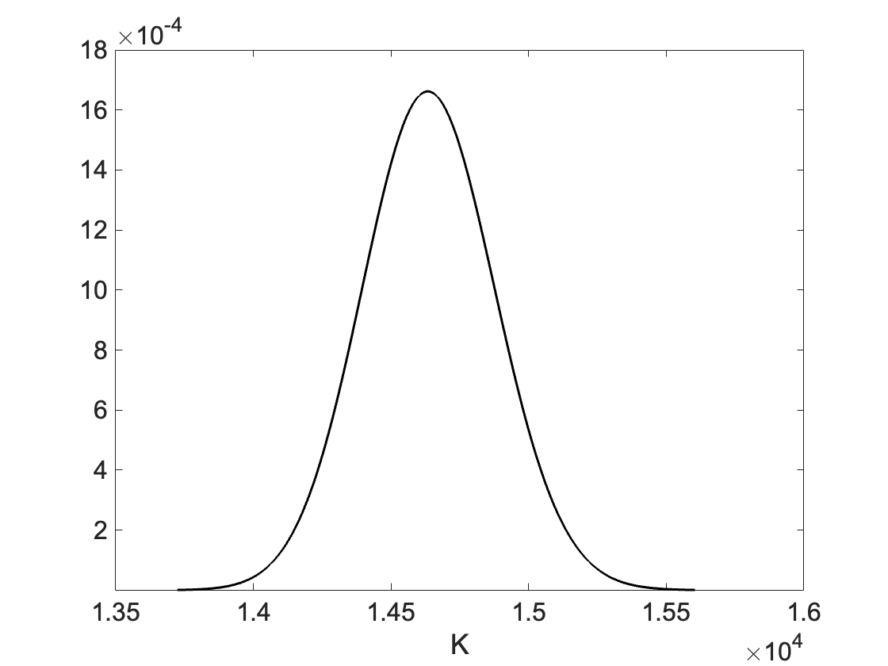

# Risk-Neutral Probability Measure

This sections summarizes results of probability theory necessary to arrive at the definition of the risk-neutral probability measure. The latter is a fundamental concept in option pricing theory. A method on how to compute the risk-neutral probability measure from market data is also provided. 

The theory presented in these notes is based on the lecture notes Stochastic Calculus, Financial Derivatives and PDE's [^1], by prof. S. Calogero. They are intended as a condensed summary of the material, and any mistakes are my own. I am grateful to the author for making this material publicly available.

## 1. Theory

### Martingale
A central concept used in the following is the notion of a martingale. 

**Definition 1**  
A stochastic process $\\{M(t)\\}\_{t \ge 0}$ is called a martingale with respect to the filtration $\\{\mathcal{F}(t)\\}\_{t \ge 0}$ if it is adapted to $\\{\mathcal{F}(t)\\}_{t \ge 0}$, $M(t)\in L^1(\Omega)$ for all $t\ge 0$, and

$$
\mathbb{E}[M(t)\mid \mathcal{F}_s] = M(s), \qquad 0 \le s \le t, \qquad (1.0)
$$

for all $t \ge 0$. From this defintion is clear that the process $M$ at a future time $t$, conditioned on all the past informations up to time $s$, will on average equal $M(s)$. As it will be clear in the next sections, condition (1.0) is tightly linked to arbitrage-free markets.

### Novikov's condition
Let $\\{ \theta(t) \\}\_{t \ge 0} \in \mathcal{C}^0[\mathcal{F}(t)]$ satisfy

$$
\mathbb{E}[\exp \left( \frac{1}{2} \int_0^T \theta(t)^2 dt \right)]< \infty, \qquad \text{for all } T>0. \qquad (1.1)
$$

**Theorem 1**

Then the stochastic process $\\{ Z(t) \\}\_{t \ge 0}$ given by

$$
Z(t) = \exp \left( - \int_0^t \theta(s) dW(s) = \frac{1}{2} \int_0^t \theta(s)^2 ds \right) \qquad (1.2)
$$

is a martingale relative to the filtration $\\{ \mathcal{F}(t)\_{t \ge 0} \\}$. 

### Girsanov's theorem
Let $\\{ \theta(t) \\}\_{t \ge 0} \in \mathcal{C}^0[\mathcal{F}\_W(t)]$ satisfy condition (1.1). It follows from theorem Theorem 1 that process (1.2) is a martingale relative to the filtration $\\{\mathcal{F}\_W(t) \\}\_{t \ge 0}$. Then, by the martingale property, $\mathbb{E}[Z(t)]=\text{const}$ for all $t \ge 0$. But $Z(0)=1$, thus $\mathbb{E}[Z(t)]=1$ for all $t \ge 0$. Hence, one can use the stochastic process $\\{ Z(t) \\}\_{t \ge 0}$ to construct an equivalent probability measure $\widetilde{\mathbb{P}}$ to $\mathbb{P}$. 

**Theorem 2**

Consider the stochastic process $\\{ \widetilde{W}(t) \\}\_{t \ge 0}$

$$
\widetilde{W}(t) = W(t) + \int_0^t \theta(s) ds. \qquad (1.3)
$$

Then $\\{ \widetilde{W}(t) \\}\_{t \ge 0}$ is a $\widetilde{\mathbb{P}}$-Brownian motion. 

As a result we have that $\widetilde{\mathbb{E}} [\widetilde{W}(t)\|\mathcal{F}\_W(s)] = \widetilde{W}(s)$, for $0 \le s \le t$. 

### Arbitrage-free market
We consider now a 1+1 dimensional market, that is a portoflio made of $\\{h\_{S(t)},h\_{B(t)} \\}$ shares of a stock $S(t)$ and of a bond $B(t)$. As is customary, the stock price $S(t)$ is assumed to evolve according to a geometric Brownian motion

$$
dS(t) = \mu(t)S(t)dt + \sigma(t) S(t) dW(t)
$$

and the bond price $B(t)$ follows the equation

$$
dB(t) = B(t)R(t)dt.
$$

The portfolio $\\{ h\_{S}(t),h\_{B}(t) \\}\_{t ge 0}$ is said to be self-financing if its value $V(t)$ satisfies

$$
dV(t) = h_{S}(t) dS(t) + h_{B}(t) dB(t). \qquad (1.4)
$$

That is, changes in $V(t)$ arise solely from changes in the values of the stock and the bond and not due to changes in the number of shares. 

Now let $\\{ \theta(t) \\}\_{t \ge 0}$ be the stochastic process

$$
\theta(t) = \frac{\mu(t) - R(t)}{\sigma(t)} \qquad (1.5)
$$

and $\\{ Z(t) \\}\_{t \ge 0}$ defined as in (1.2), and the probability measure

$$
\widetilde{\mathbb{P}}(A) = E[Z(T) \mathbb{I}_A], \qquad A \in \mathcal{F}
$$

is a probability equivalent to $\mathbb{P}$. Furthermore, consider the discounted value $V^*(t) = D(t)V(t)$ at time $t$ where

$$
D(t) = \exp \left( - \int_0^t R(s)ds \right).
$$

**Theorem 3**

If $\\{ h\_{S}(t),h\_{B}(t) \\}\_{t \ge 0}$ is a self-financing portfolio, then $\\{ h\_{S}(t),h\_{B}(t) \\}\_{t \ge 0}$ is not an arbitrage. 

By using the self-financing condition (1.4) and simple stochastic calculus one can show that

$$
dV^*(t) = D(t)h_S(t) S(t) \sigma(t) d\widetilde{W}(t).
$$

Thus, $\\{ V^*(t) \\}\_{t \ge 0}$ is a $\widetilde{\mathbb{P}}$-martingale relative to the filtration $\\{ \mathcal{F}\_W(t) \\}\_{t \ge 0}$, i.e.,

$$
\widetilde{E}[D(t)V(t)|\mathcal{F}_W(s)] = D(s)V(s), \qquad \text{for all } 0 \le s \leq t. \qquad (1.6)
$$

and by properties of martingales

$$
\widetilde{E}[D(t)V(t)] = \widetilde{E}[D(0)V(0)] = \widetilde{E}[V(0)]. \qquad (1.7)
$$

Suppose, for the sake of contradiction, that the portofolio is an arbitrage. Then $V(0)=0$ and since $D(0)=1$ we have $V^*(0)=0$. By (1.7) we know that

$$
\widetilde{E}[V^*(t)] = 0. \qquad (1.8)
$$

Now, let $T>0$ such that $\mathbb{P}(V(T) \ge 0)=1$ and $\mathbb{P}(V(T) > 0) > 0$. Given that $\mathbb{P}$ and $\widetilde{\mathbb{P}}$ are equivalent we must have that $\widetilde{\mathbb{P}}(V(T) \ge 0)=1$ and $\widetilde{\mathbb{P}}(V(T) > 0) > 0$. Furthermore, since $D(t)$ is positive we also have $\widetilde{\mathbb{P}}(V^\*(T) \ge 0)=1$ and $\widetilde{\mathbb{P}}(V^\*(T) > 0) > 0$. However, this contradicts (1.8). Thus the portfolio is not an arbitrage. 

### European option pricing
Consider a European option with pay-off $Y$ at maturity time $T>0$. Denote by $\Pi\_Y(t)$ the price of this derivative when sold at $t<T$. We make the following assumptions:

1. the seller will only invest the premium $\Pi\_Y(t)$ in the $1+1$ dimensional market made of the underlysing stock and a bond.
2. the portfolio is self-sinancing.

By (1.6) we have that

$$
\begin{aligned}
V(t) &= \frac{1}{D(t)} \widetilde{E}[D(T)V(T)|\mathcal{F}_W(t)] \\
&= \widetilde{E}[\frac{D(T)}{D(t)}V(T)|\mathcal{F}_W(t)] \\
&= \widetilde{E}[ \exp \left( -\int_t^T R(s) ds \right) V(T)|\mathcal{F}_W(t)],
\end{aligned}
$$

where in the second line we used the fact that $D(t)$ is $\mathcal{F}\_W(t)$ measurable. We now require the hedging condition $V(T)=Y$, that is the value of the seller portfolio is sufficient to pay off the buyer of the option at maturity time $T$. We then have

$$
V(t) = \widetilde{E}[ \exp \left( -\int_t^T R(s) ds \right) Y|\mathcal{F}_W(t)].
$$

If we know interpret $V(t)$ as the value of the investment of the option seller at time $t$, i.e. $\Pi_Y(t)$, we obtain the risk-neutral option price

$$
\Pi_Y(t) = \widetilde{E}[ \exp \left( -\int_t^T R(s) ds \right) Y|\mathcal{F}_W(t)]. \qquad (1.9)
$$

This is viewed as a fair condition on the price of the derivative, since from Theorem 3 we know that this portfolio is not an arbitrage. 

If we know assume that $R(t) = \text{const}$, $\sigma(t) = \text{const}$ and the pay-off given by

$$
\begin{aligned}
Y &= (S(T)-K)_+ \qquad \text{for call options}\\
Y &= (K-S(T))_+ \qquad \text{for put options}
\end{aligned}
$$

with $K$ the strike price, one can solve (1.9) analytically and arrive at the Black-Sholes formula. 

## 2. Computation

### Risk-neutral probability density
With the above assumptions given, Eq. (1.9) can be solved, for example for call options:

$$
\Pi(S,t) = e^{-R(T-t)} \int_K^\infty p(Q,T | S,t )(Q-K) dQ, \qquad (2.0)
$$

where $p$ is the risk-neutral probability density and $Q = S(T)$. By taking the first derivative with respect to the strike price one obtains:

$$
\begin{aligned}
e^{-R(T-t)} \frac{\partial }{\partial K} \Pi(S,t) &= \frac{\partial }{\partial K} \int_K^{\infty}  p(Q,T | S,t) \left( Q - K \right) dQ \\
&=  \int_K^{\infty}  \frac{\partial }{\partial K} \left[ p(Q,T | S,t) \left( Q - K \right) \right] dQ - \left[ p(Q,T | S,t) \left( Q - K \right) \right]|_{Q=K} \cdot 1 \\
&=  -\int_K^{\infty}  p(Q,T | S,t)  dQ,
\end{aligned}
$$

Deriving again with respet to $K$ we have

$$
e^{-R(T-t)} \frac{\partial^2}{\partial K^2}\Pi(S,t) = p(K,T|S,t). \qquad (2.1)
$$

Thus, given an option chain one can reconstruct numerically the dendity $p$ from discrete derivatives of the oprion price w.r.t. strike price. 

<figure align="center">
  
  <figcaption>
    <b>Figure 1.</b> Risk-neutral probability density of a stock index computed from open-source market data.
  </figcaption>
</figure>

[^1]: Calogero, S., 2019. Stochastic Calculus Financial Derivatives and PDE’s. Lecture notes for the course MMA711 at Chalmers University of Technology.

