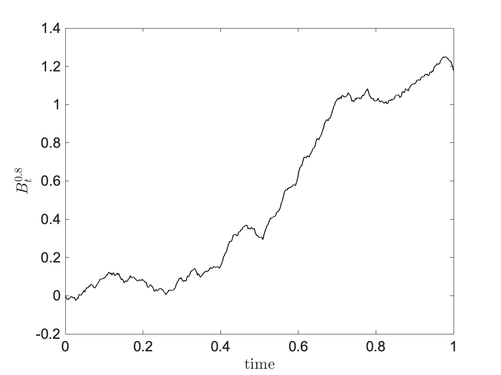
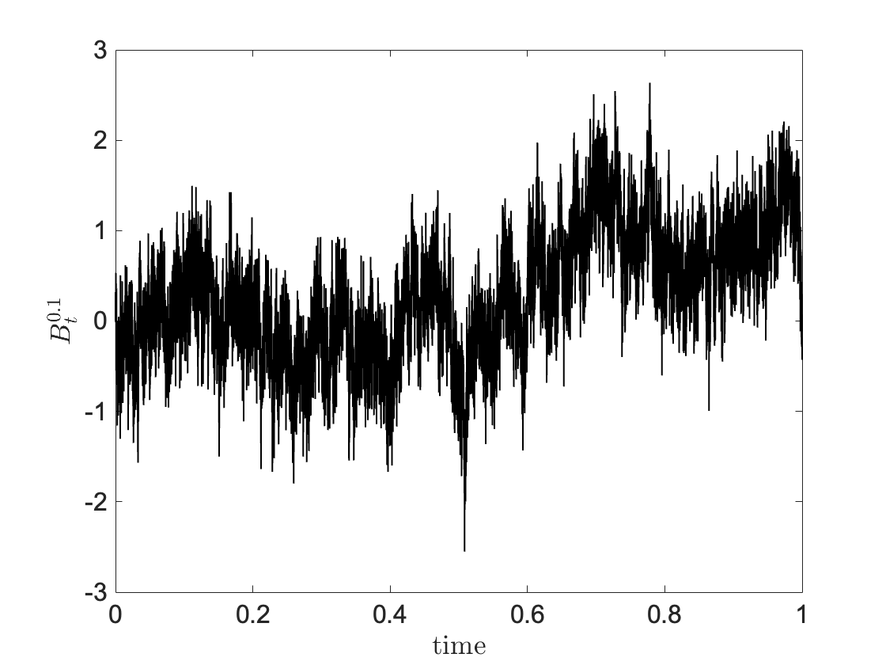
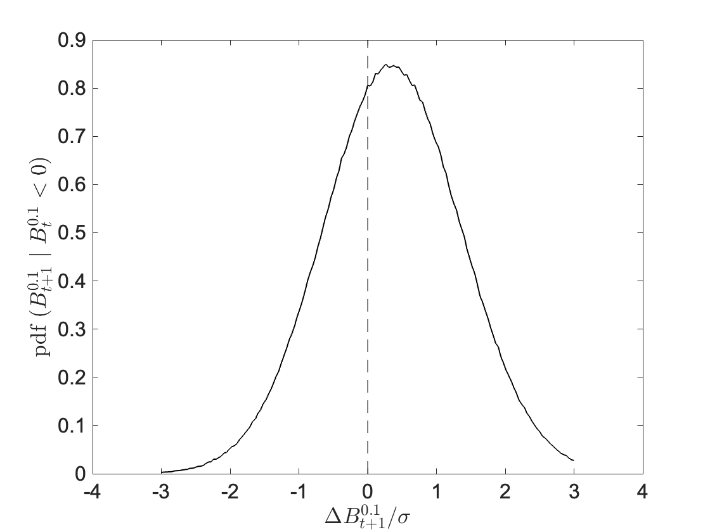

# Fractional Brownian Motion

Many phenomena in nature, most prominently the motion of particles suspended in a quiescent medium, are well described by standard Brownian Motion $B_t$. While this is a good approximation in several instances, studies on random processes, e.g. turbulent flows
and financial time series, have shown strong interdependence between distant samples. To this aim an extension was put forward in the seminal paper of Mandelbrot, 1968, where long-range dependence is regulated by the Hurst exponent $H \in (0,1)$. In the following, some basic results about Fractional Brownian Motion (FBM) and Fractional Brownian Noise (FBN) are illustrated with a focus on its implications for high-frequencies trading strategies. A recent application of FBM driven partciles and transport dynamics can be found in [^1]

## 1. Theory

A cenetered Gaussian procces $B^H_t$ is defined to be a Fractional Brownian Motion if its covariance matrix has the following form:

$$
\mathbb{E}[B^H_t B^H_s] = \frac{1}{2} \left( s^{2H}+t^{2H} - |t-s|^{2H} \right). \qquad (1.0)
$$

As for standard Brownian Motion, recovered for $H=1/2$, a self-similarity exists: for any constant $a>0$, the process $\\{ a^{-H}B^H_{at}\\}\_{t \ge 0}$ has the same distribution as the process $\\{ B^H_{t}\\}\_{t \ge 0}$. This makes it appealing from a fincancial view-point, since it is often the case that time-series looked at different time-scales are found to be statistically equivalent. 

From (1.0) one finds that

$$
\mathbb{E}[ (B^H_t-B^H_s)^2] = |t-s|^{2H} . \qquad (1.1)
$$

The process has then stationary increments and the scaling of their covariance can be computed numerically. This property is a ‘fingerprint’ of such processes. 

Define the sequence $\\{X\_n, \ n \ge 1 \\}$ with $X\_n = B^H\_n-B^H\_{n-1}$. Its covariance (stationary) function is [^2]:

$$
\rho_H(n) = \frac{1}{2} \left( (n+1)^{2H} + (n-1)^{2H}-2n^{2H} \right). \qquad (1.2)
$$

By looking at the sign of $\rho_H(n)$ we discover that, two increments $B^H\_k-B^H\_{k-1}$ and $B^H\_{k+n}-B^H\_{k+n-1}$ are positively correlated if $H>1/2$ and negatively correlated if $H<1/2$. In trading language, the first case ($H>1/2$) corresponds to **trend-following** strategies where a positive increment in the past is more likely to be followed by another positive increment. The second case (H<1/2) naturally links to a **contrarian regime**. 

It is easily shown that $\rho_H(n)$ decays only polynomially in $n$. Morevoer for $H>1/2$ we have $\sum_{n=1}^\infty \rho_H(n) = \infty$. This is often reffered to as *long-range dependece*. Clearly, unlike standard Brownian motion, information from the past helps predict future movements. 

## 2. Computation

As an illustration, Fig. 1 shows sample paths of FBM and its corrisponding increments for $H=0.8$ (left column) and $H=0.1$ (right column). 

  
  

  
  

<b>Figure 1:</b> FMB realization and its corresponding increments for $H=0.8$ (left column) and for $H=0.1$ (right column).

The difference between the two cases is startlingly clear. The signal for $H=0.8$ looks more regular with regions of persistent upward and downward trends. On the contrary, the signal for $H=0.1$ is extrimely rough with no preferential trend. 

Consider now, as an example, the case $H=0.1$. Suppose that a preliminary analysis on a time-series has established that, at the relevant trading time-scale, the signal is well approximated by $B\_t^{0.1}$. This can be achieved, for example, by computing the scaling of increment variance (1.1) or by a trained neural network. A simple **trading strategy** would then be to open a long position every time a negative price difference is recorded at the end of the previous time period. By applying the strategy a sufficiently large number of times, we know by (1.2) that we have a statistical adavantage. This is illustred in Fig. 2 where the pdf of $\Delta B^{0.1}\_{t+1}$ conditioned on $\Delta B^{0.1}\_{t}<0$ is computed numerically on $10^4$ realizations of Fractional Brownian Motion. Clearly, the probability is shifted towards positive returns. 

The question is, of course, whether such signals exist in the real market and if they last a sufficinetly long time to allow for statistical arbitrage.

  

<b>Figure 2:</b> Pdf of $\Delta B^{0.1}_{t+1}$ conditioned on $\Delta B^{0.1}_{t}<0$.

[^1]: Cifani, P. and Flandoli, F., 2025. Diffusion Properties of Small-Scale Fractional Transport Models, Journal of Statistical Physics.

[^2]: Nualart, D., 2006. The Malliavin calculus and related topics. Berlin, Heidelberg: Springer Berlin Heidelberg.
