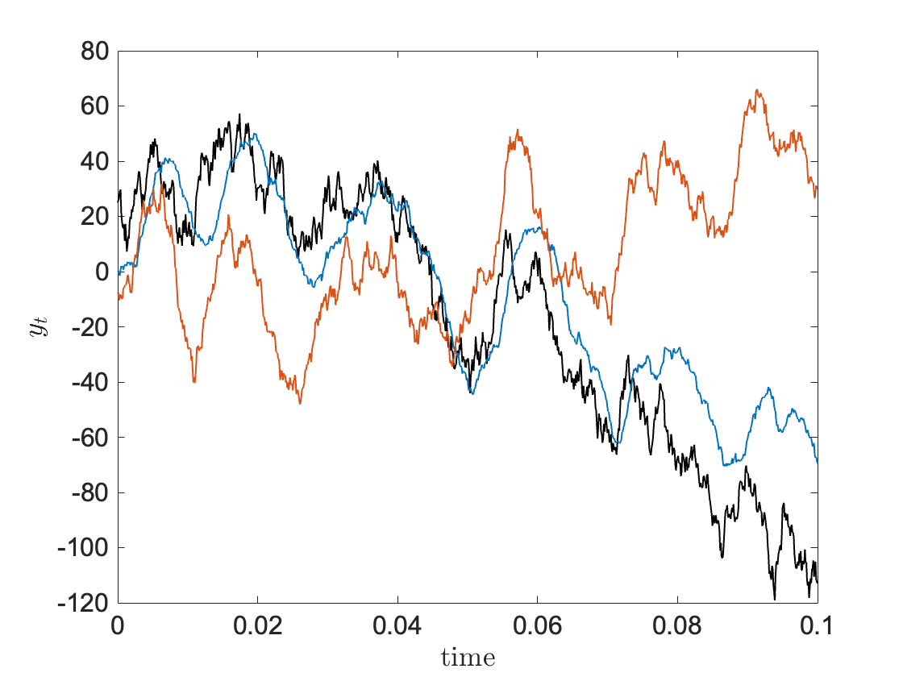

# Pairs Trading

Pairs trading aims to construct a stationary process by a linear combination of signals that contain drift. If this procedure is successful, one obtains a statistical arbitrage opportunity. By initiating a long position at a price well below the mean of the process, by the stationarity of the process, one generates a positive return when closing the position at around the mean. The opposite opportunity presents itslef for short selling.

The theory presented in these notes is based on the textbook [^1]. They are intended as a condensed summary of the material regarding cointegration.

## 1. Theory
The mathematics behind pairs trading is known as **cointegration**. In the following, I will introduce the necessary tools to understand cointegrated processes.

### VAR(p) processes
The vector autoregressive model of order $p$, namely VAR(p), is defined as follows:

$$
y_t = \nu + A_1 y_{t-1}+ \cdots + A_p y_{t-p} + u_t, \qquad t \ge p \qquad\qquad  (1.0)
$$

where $y_t = (y_{1t},...,y_{Kt})'$ is a $K$-dimensional random vector, $A_i$ are coefficient matrices of size $(K \times K)$, $\nu=(\nu_1,...,\nu_K)'$ is vector of constants of size $(K\times 1)$ and $u_t=(u_1,...,u_K)'$ is a $K$-dimensional white noise vector with covariance $\mathbb{E}[u_tu_s']= \delta_{t,s} \Sigma_u$. 

Model (1.0) can be conveniently rewritten in a $Kp$-dimensional form:

$$
\mathbf{Y}_t = \boldsymbol{\nu} + \mathbf{A} \mathbf{Y}_{t-1} + \mathbf{U}_t \qquad (1.1)
$$

where $\mathbf{Y}_t = (y\_t, y\_{t-1},...,y\_{t-p+1})'$ (see [^1] for the complete definition of the terms in (1.1)). This shows that most of the properties of (1.0) can be understood as an extension of a VAR(1) model

$$
y_t = \nu + A_1 y_{t-1}+u_t. \qquad (1.3)
$$

Given an initial condition $y_0$ and a white-noise vector $u_t$, by recursion one finds that

$$
y_t = (I_K+A_1+ \cdots +A_1^{t-1}) \nu + A^t_{y_0} + \sum_{i=0}^{t-1} A^{i}_1 u_{t-i}. \qquad (1.4)
$$

From (1.4) we deduce that if all eigenvalues of $A_1$ are less than $1$ in absolute value the $VAR(1)$ is *stable*. This condition is equivalent to

$$
\text{det}(I-A_1z) \ne 0 \qquad \text{for } |z| \le 1, \qquad\qquad (1.5)
$$

i.e., the polynomial in (1.5) has no roots inside or on the unit circle. The extension of (1.5) to $VAR(p)$ reads as follows:

$$
\text{det}(I-A_1z-\cdots-A_pz^p) \ne 0 \qquad \text{for } |z| \le 1. \qquad\qquad (1.6)
$$

### Integrated processes
Consider now a $VAR(1)$ process. A particular scenario of interest is the case in which only a unit root is present and all other roots are outside of the unit circle. For a centered univariate process we have

$$
y_t = y_{t-1}+u_t, \qquad (1.7)
$$

that is, $y_t$ is a random walk. In general, univariate processes with $d$ unit roots are called *integrated of order* $d$ or $I(d)$. Process (1.7) is then $I(1)$ and can be made stable by differentiation:

$$
\Delta y_t := (1-L) y_{t} = u_t, \qquad (1.8)
$$

with $L$ the lag operator. Analogously, it can be shown that for a $K$-dimensional $VAR(p)$ process with $d$ unit roots we have that 

$$
\Delta^d y_t := (1-L)^d y_{t} \qquad (1.9)
$$

is a stable process. That is, each variable becomes stationary upon differencing. 

### Cointegrated processes
The concept can be understood (as shown in [^1]) by considering a $VAR(2)$ process

$$
y_t = A_1 y_{t-1} + A_2 y_{t-2} +u_t. \qquad (1.10)
$$

Suppose that the process is unstable, and in particular one or more roots are unitary while the rest of them lies outside of the unit circle (see condition (1.6)). By the former assumptions it follows that $\|I-A_1-A_2\|=0$ and thus the matrix

$$
\Pi := -(I-A_1-A_2) \qquad (1.11)
$$

is singular. Suppose $\text{rank}(\Pi) = r < K$. Then we can decompose $\Pi = \alpha \beta'$. Now we assume that differencing once is enough to make the process stable, i.e. $y\_t$ is $I(1)$. We thus have

$$
\Delta y_t = \Pi y_{t-1} + \Gamma_1 \Delta y_{t-1} + u_t,
$$

with $\Gamma_1 := -A_2$. Since the right-hand side only contains stationary processes, it follows that $\alpha \beta'y_{t-1}$ must be stationary. Multiplication by the left inverse $(\alpha' \alpha)^{-1} \alpha'$ isolates the cointegrating relation $\beta' y_t$. 

The interesting case in practise is often when all individual variables are either $I(1)$ or $I(0)$. A $K$-dimensional $VAR(p)$ process is called *cointegrated* of rank $r$ if

$$
\Pi := -(I-A_1- \cdots - A_p)
$$

has rank $r$. The matrix $\beta$ from the decomposition $\Pi = \alpha' \beta'$ is called *cointegration vectors*. Edge cases are: $r=0$, for which $\Delta y_t$ is a stable $VAR(p-1)$ process; $r=K$, for which $y_t$ has no unitary roots and hence stable. 

## Computations
A $VAR(1)$ process of dimension $K=3$ is shown in Figure 1. 

  

<b>Figure 1:</b> $VAR(1)$ process of dimension $K=3$ and cointegration rank $r=2$.

The signals represented by the black and blue lines follow, on average, the same direction, whereas the signal represented by the orange line deviates from the other processes. The cointegration theory tells us precisely what linear combination of these signals produces a stationary process. Application of the theory above yields $r=2$. Hence, the two rows of the matrix $\beta$, $\beta_1$ and $\beta_2$, represent the two cointegration vectors. Fig. 2 shows the signals $\beta_1 \cdot y_t$ and $\beta_2 \cdot y_t$. The dashed lines represent $\pm 1.5$ the standard deviation of the signals.

  
  

<b>Figure 2:</b> Signals $\beta_1 \cdot y_t$ (left panel) and $\beta_2 \cdot y_t$ (right panel).

In the theoretical case, the **trading strategy** is simple: buy below the dashed line at the bottom and sell above the dashed line at the top. In practice, however, the theoretical scenario is seldom verified. 

### Practical considerations
When analysing time-series one does not know a priori what the cointegration rank $r$ is. However, if the process is assumed to be Gaussian, parameter estimation is possible through Maximum Likelihood estimation under the constraint $\text{rank}(\Pi)=r$. Analytical formula exists in this case, which yield the cointegration vectors $\beta$ (see [^1] for details). 

A number of issues arise in real-world time-series.

1. The main underlying assumption is that time-series are well approximated by model (1.0), which is of course questionable in many cases. 

2. Suppose one has data on $N$ time-series and seeks to find the cointegration relations among groups of dimension $K$. The total number of relevant combinations is $\frac{N!}{K!(N-K)!}$ which for fixed $K$ scales as $\sim N^K/K!$. For large $N$, this search can become computationally prohibitive.

3. Since future information is not available, one has access only to historical values. It is on these datasets that $\beta$ is computed. In actual trading a portfolio $\beta'y_t$ is constructed when a position is opened, and $\beta$ held fixed until the position is closed. However, there is no guarantee that $\beta$ will stay approximately the same within this trading time window. In fact, it often varies continuously over time rather than remaining constant.

[^1]: Kilian, L., 2006. New introduction to multiple time series analysis, by helmut lütkepohl, springer, 2005. Econometric theory.
