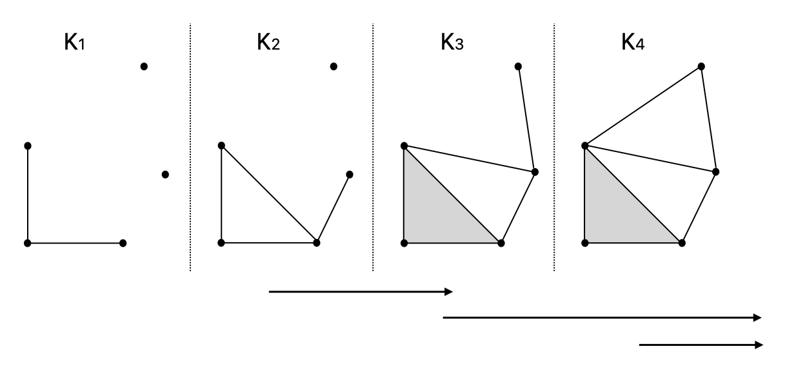
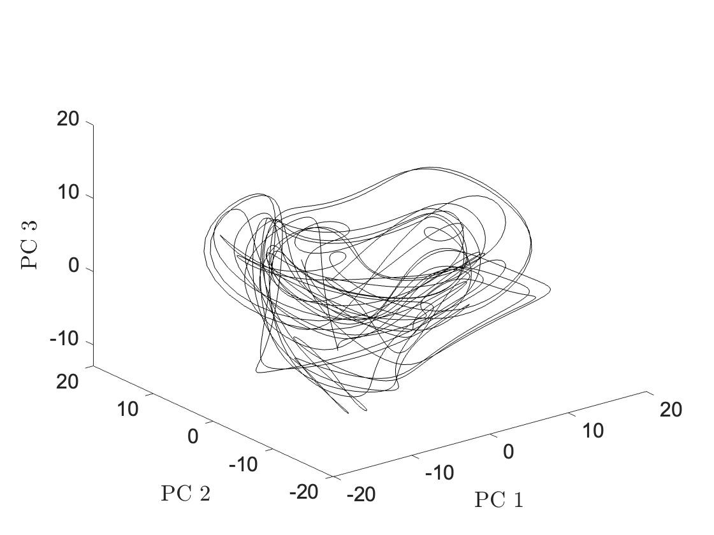
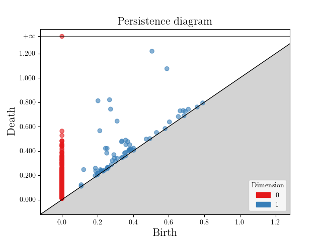
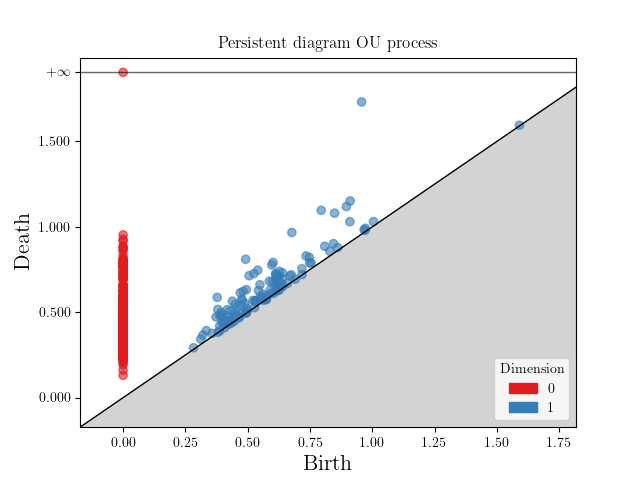

# Persistent Homology

Persistent Homology is concerned with the studies of the shape of data by tracking how topological features appear and disappear across multiple scales. It finds applications in a wide range of fields, including data analysis, machine learning, image processing, computational biology and finance, where it helps uncover structural patterns in complex datasets. 

The theory presented in these notes is based on the lecture notes Introduction to Persistent Homology [^1]. They are intended as a condensed summary of the material, and any mistakes are my own. I am grateful to the author for making this material publicly available.

After introducing the fundamental concepts, a numerical example is presented to illustrate their application. The open-source library GUDHI [^2] has been used to generate part of the presented results.

## 1. Theory

### Homotopy

The first concept needed is that of homotopy. The precise definition, given in [^1], is the following:

**Definition 1 (Homotopy)**

Continuous maps $f,g: X \to Y$ between metric spaces $X$ and $Y$ are homeotopic, denoted $f \simeq g$, if there exists a continuous deformation of $f$ into $g$. Such a deformation is called a homotopy. 

Next is the definition of homotopy equivalence.

**Definition 2 (Homotopy equivalence)**

Metric spaces $X$ and $Y$ are homotopy equivalent, denoted $X \simeq Y$, if there exist maps $f: X \to Y$ and $g:Y \to X$, sich that $f \circ g \simeq id_Y$ and $g \circ f \simeq id_X$. Such maps are called homotopy equivalences. Consider the simple example in Figure 1. 

  

<b>Figure 1:</b> Example of homotopy and homotopy equivalence.

The space $X$ is composed of one single point. The space $Y$ is composed of a (full) disk to which a line is attached and a point. The map $f : X \to Y$ which sends $X$ into point $A$ in $Y$ is homotopic to the map $g : X \to Y$ that sends $X$ into point $B$ in $Y$. An example of homotopy is represented by the dahsed line connecting $A$ and $B$. The homotopy class $\[ f \]$ is the set of all maps that can be deformed into $f$. In this example we have two classes $\\{ [f_1], [f_2] \\}$, corresponding to the connected components of $Y$. The set $Y \setminus \\{ C\\}$ is homotopy equivalent to $X$, which is said to be contractible. 

As it turns out homotopy equivalent spaces have the same homology groups.

### Simplicial complexes and their constructions

We will not delve into the precise definition of simplicial complexes and their construction. We refer the interested reader to [^1] or to the many textbooks on this subject. The rough idea is the following: a simplicial complex is a space obtained by gluing simplices (points, line segments, triangles, and their higher-dimensional analogues) along their faces. When a topological space admits such a triangulation, its topological invariants (e.g., homology groups) can be computed from the corresponding simplicial complex. 

We briefly introduce the necessary notation used in the remainder of this notes. Let $d,k \in \mathbb{N}$ and let $V = \\{v_0,v_1,...,v_k \\} \subset \mathbb{R}^d$ be a collection of points. Their affine combination is any sum that satisfies 

$$
\sum_{i=1}^k \alpha_i v_i \qquad \text{with } \ \sum_{i=1}^k \alpha_i = 1.
$$

The subset $V$ is called convex if for each $x,y \in V$ the line segment between $x$ and $y$ lies inside $V$. Its convex hull, $Conv(V)$, is the smallest convex set containing $V$. The collection of points $\\{v_0,v_1,...,v_k \\}$ are affinely independent if $\\{ v_1 - v_0, ..., v_k-v_0 \\}$ are linearly independent. These difference vectors span a $k$-dimensional subspace of $\mathbb{R}^d$. 

**Definition 3 (Simplex)**

Let $k,d \in \mathbb{N}$ with $k \leq d$. A geoemtric $k$-simplex $\sigma \subset \mathbb{R}^d$ is the convex hull of $k+1$ affinely independent points $\\{ v_0, ..., v_k \\}$. That is

$$
\sigma = Conv \\{ v_0, ..., v_k \\}. \qquad (1.0)
$$

**Definition 4 (Simplicial complex)**

A geometric simplicial complex $K$ in $\mathbb{R}^d$ is a collection of geometric simplices such that

1. every face of a simplex of $K$ is also in $K$
2. the intersection of any two simplices of $K$ is either empty or a face of both.

Since data are not given in the form of simplicial complexes, the preliminary step to computation is to construct such complexes. This is in itslef is a rather large topic, which we will not touch upon here. We will just mention that such constructions take as input a sample $S$, subset of some metric space $X$, and scale $r$. A widely used construction is the so-called **Rips complex**. We write Rips$(S,r)$ to indicate of such complex at scale $r$. 

### Homology

Informally, homology detects holes of different dimensions in a simplicial complex. Let $K$ be a simplicial complex of dimenion $n$ and choose coefficients from a field $\mathbb{F}$, the most commonly used in computations being $\mathbb{Z}_2$. 

**Definition 5 (Chains)**

Let $p \in \\{ 0,...,n \\}$ denote the number of simplices of dimension $p$ in $K$. A $p$-chain is a (formal) sum $\sum_{i=1}^{n_p} \lambda_i \sigma_i^p$ with $\lambda_i \in \mathbb{F}$ and $\sigma_i^p$ being a simplex of dimension $p$ in $K$. In Figure 2 and example of addition of two chains in $\mathbb{Z}_2$ is shown.

  

<b>Figure 2:</b> Example of addition of chains in $\mathbb{Z}_2$.

**Definition 6 (Chain gruop)**

The chain group $C_p(K;\mathbb{F})$ is the vector space of all $p$-chains. 

We can think of $p$-simplices in $K$ as base vetors for $C_p(K;\mathbb{F})$. Clearly, $C_p(K,\mathbb{F}) \cong \mathbb{F}^{n_p}$. 

**Definition 7 (Boundary map)**

The boundary map

$$
\partial_p: C_p(K;\mathbb{F}) \to C_{p-1}(K;\mathbb{F})
$$

is the linear map defined on the basis of $C_p(K;\mathbb{F})$ as follows. For each $p$-oriented simplex $\sigma = \langle v_0,...,v_p \rangle$ we define

$$
\partial_p \sigma \sum_{i=0}^p (-1)^i \langle v_0,v_1,...,v_{i-1},v_{i+1},...,v_p \rangle. \qquad (1.1)
$$

A key result is that the composition of two consecutive boundary maps is the trivial map. That is,

$$
\partial^2  = 0. \qquad (1.2)
$$

As mentioned at the beginning of this section, the goal is to measure holes. The latter are represented by a specific chains called *cycles*. In particular, cycles are chains whose boundary is zero. However, not all cycles represent holes, since they can simply be boundaries of a simplex. An example of these concepts is shown in Figure 3.

  

<b>Figure 3:</b> A cycle that is boundary (left) and a cycle that is a hole (right).

**Definition 8 (Homology group)**

Let $K$ be a simplicial complex. Let $\mathbb{F}$ be a field and $q \in \mathbb{N}$. We define [^1]

1. the group of $q$-cycles as $Z_q(K;\mathbb{F}) = \text{ker} \ \partial_q \leq C_q(K;\mathbb{F})$
2. the group of $q$-boundaries as $B_q(K;\mathbb{F}) = \text{Im} \ \partial_{q+1} \leq Z_q(K;\mathbb{F}) \leq C_q(K;\mathbb{F})$
3. $q$-homology group as the quotient $H_q(K;\mathbb{F}) = Z_q(K;\mathbb{F})/B_q(K;\mathbb{F})$.

The dimension of $H_q$, called the Betti number $\mathcal{b}_q$, is what we are after. Let's shed some light on these definitions by the example in Figure 2. There are two independent cylces: $c_1 = \langle A,B \rangle + \langle B,C \rangle + \langle C,A \rangle$ and $c_2 = \langle B,C \rangle + \langle C,D \rangle + \langle D,B \rangle$. Thus dim $(Z_1)=1$. Hower $c_1$ is the boundary $\partial_2 \langle A,B,C \rangle$. Thus dim $(H_1)=1$, i.e. we only have one hole. More precicely, elements of $H_q$ are equivalence classes of $q$-cycles. Given two elements $c_1,c_2 \in Z_q$, the cycles represent the same homology class if they differ by a boundary:

$$
c_1 \sim c_2 \qquad \text{ if } c_1-c_2 \in B_q.
$$

The homology class represented by a cycle $c$ is denoted by $\[c\]$. Besides $H_1$, an interesting homology group often computed in applications is $H_0$, whose dimension corresponds to the number of connected components. In the above exmaple we therefore have dim $(H_0)=1$. 

The Betti numbers can be computed as follows. First, by the rank-nullity theorem applied to the linear map $\partial_p : C_p(K,\mathbb{F}) \to C_{p-1}(K,\mathbb{F})$ it follows that $\text{dim }C_p(K,\mathbb{F}) =  \text{dim ker } \partial_p + \text{rank } \partial_p$. But $\text{dim }C_p = n_p$ (the number of $p$-simplices in K). So we have

$$
\text{dim ker } \partial_p = np - \text{rank } \partial_p$. \qquad (1.3)
$$

Then, by definition of $H_q(K,\mathbb{F})$ and (1.3) we obtain

$$
\begin{aligned}
\mathcal{b}_p &= \text{dim ker } \partial_p - \text{rank } \partial_{p+1} \\
&= np - \text{rank } \partial_p - \text{rank } \partial_{p+1}. \qquad (1.4)
\end{aligned}
$$

Thus, the computation of $\mathcal{b}_p$ is a purely linear algebra excercise, provided $n_p$ and the baoundary maps. 

### Persistent Homology

A few definition are needed to arrive at that of peristent homology. 

**Definition 9 (Induced maps)**

Let $f : K \to L$ be a simplicial map. The induced maps $f_\\#$ and $f_*$ are defined as follows. Map $f_\\# : C_q(K;\mathbb{F}) \to C_q(L;\mathbb{F})$ is the linear map defined as 

$$
f_{\sharp}\left(\sum_i a_i \sigma_i \right) = \sum_{ \\{ i \mid \dim(f(\sigma_i)) = q \\} } a_i f(\sigma_i). \qquad (1.5)
$$

Map $f_* : H_q(K;\mathbb{F}) \to H_q(L;\mathbb{F})$ is the linear map defined as 

$$
f_*\big([\alpha]\big) = [f_{\sharp}(\alpha)]. \qquad (1.6)
$$

In essence, the map $f$ induces a map $f_{\\#}$ between chains such that only the images of simplices $\sigma_i$ of dimension $q$ are retained. This chain map then induces a map $f_*$ on homology by sending $[\alpha]$ into $[f_{\\#}(\alpha)]$. 

**Definition 10 (Functoriality of induced maps)**

Let $f:K \to L$ and $g: L \to M$ be simplicial maps. Then we have

$$
(g \circ f)_{\sharp} = g_{\sharp} \circ f_{\sharp} \qquad (g \circ f)_* = g_* \circ f_*. \qquad \qquad (1.7)
$$

In simple terms, applying simplicial maps in sequence induces the same chain and homology maps as applying their composition.

**Definition 11 (Filtration)**

Let $K$ be a simplicial complex. A filtration of $K$ is a squence of subcomplexes

$$
K_1 \leq K_2 \leq ... \leq K_m = K.
$$

The filtration can technically be written using natural inclusion maps

$$
K_1 \xrightarrow{i_{1,2}} K_2 \xrightarrow{i_{2,3}} \cdots \xrightarrow{i_{m-1,m}} K_m = K.
$$

This indices the linear maps

$$
H_q(K_1;F) \xrightarrow{(i_{1,2})_*} H_q(K_2;F) \xrightarrow{(i_{2,3})_*} \cdots \xrightarrow{(i_{m-1,m})_*} H_q(K_m;F) = H_q(K;F).
$$

The $q$-dimensional persistent homology groups are images of the maps

$$
(i_{s,t})_* : H_q(K_s;F) \to H_q(K_t;F) \qquad (1.8)
$$

for all $0 \leq s \leq t \leq m$. The **persistent Betti numbers** are defined as follows: $\beta_{s,t}^q = \text{rank }(i_{s,t})\_*$. Suppose for example that a certain filtration level, for example $s=2$, we have detected two holes, i.e. $\text{dim }H\_1(K\_2,\mathbb{F})=2$. At a later stage, $t=3$, we find that $\beta_{2,3}^1=1$. This means that only one hole remains homologically non-trivial in $K_3$, while the other has become a boundary in the larger complex. 

Persisten Betti numbers are often visualized through a so-called barcode. Figure 4 shows an example of barcode for the first homology group. 

  

<b>Figure 4:</b> Example of barcode of the first persistent homology group.

The arrows shown below the filtration represent the birth and death of homologically non-trivial loops. In $K_2$ a first hole is detected, which becomes trivial in $K_3$. Two subsequent holes are detected in $K_3$ and $K_4$, respectively, which endure beyond $K_4$. 

The long-lived elemetns of $H_q$ are deemed important in topological data analysis, as they represent a signature of the underlying process. Persistent homology is therefore a powerful tool for data analysis and processing, and it is often combined with statistical or machine learning forecasting methods to extract meaningful patterns and improve predictive modeling. 

## 2. Computations

As a benchmark for financial applications, we contrast the persistence diagram of the Lorenz–96 system, representing nonlinear structured dynamics, with that of an Ornstein–Uhlenbeck process, a standard model for mean-reverting asset prices, which provides a natural baseline.

The L96 systems is defined as follows. For $i=1,...,N$:

$$
\frac{dx_i}{dt} = (x_{i+1}-x_{i-2})x_{i-1}-x_i+F,
$$

where $x_{-1}=x_{N-1}$, $x_0=x_N$, $x_{N+1}=x_1$ and $N \ge 4$. Here we set $N=5$ and $F=16$, which causes chaotic behavior. Figure 5 shows the phase-space representation of $x(t)$ projected onto the first three principal components.

  

<b>Figure 5:</b> $x(t)$ for the L96 system projected onto the first three principal components.

Although the trajectory appears irregular and chaotic, the system remains confined to a bounded region of the phase space, indicating the presence of an underlying attractor. In practise, however, one does not have access to the full dynamical system, but rather only to a few observables. In this spirit, here we suppose that $x_1(t)=y(t)$ is the only observable. In finance, for example, such a process could represent one component of the market, for example the return of a stock index. To recover aspects of the underlying dynamics, one constructs sliding-window embeddings

$$
Y_t = \\{ y_t, y_{t-1},...,y_{t-m+1}, \\} \qquad (2.1)
$$

to obtain a point-cloud in $\mathbb{R}^m$. This approach is formally motivated by **Takens’ theorem**, which shows that for deterministic dynamical systems, under suitable conditions, the attractor dynamics can be reconstructed from a single observable when the embedding dimension $m$ is sufficiently large. In practice, the choice of $m$ is often determined empirically through parameter tuning. Here we find $m=7$ to be adeguate. 

Once the point cloud is created, one has to generate a filtration and compute the persistent Betti numbers. To accomplish this task we adopt the open-source GUDHI library [^2]. Figure 6 presents the persistent diagram of the embedding of the L96 system (left panel) and that of an Ornstein–Uhlenbeck process (right panel) with correlation time $\tau=1$. 

  
  

<b>Figure 6:</b> Persistent diagram of the L96 embedding (left panel) and of the OU embedding (right panel).

The red points (dimension 0) represent connected components that rapidly merge, indicating that the point cloud forms a single cluster. The blue points (dimension 1) correspond to holes in the data. A few elements in $H_1$ xhibit moderate persistence and lie noticeably far from the diagonal. These features reflect recurrent geometric structures of the underlying attractor. 

[^1]: Virk, Ž., 2022. Introduction to Persistent Homology. Založba UL FRI.
[^2]: The GUDHI Project (2023). *GUDHI User and Reference Manual*. Available at: https://gudhi.inria.fr/
