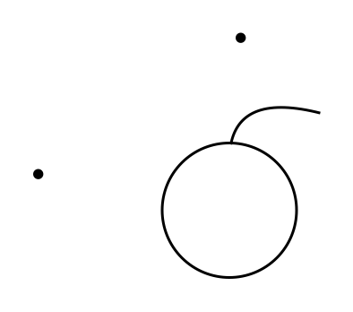
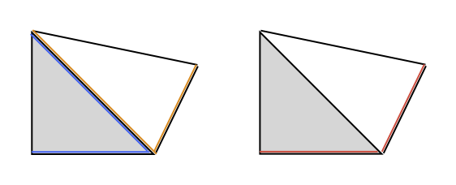
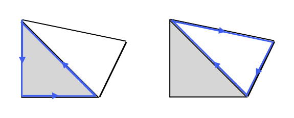

# Persistent Homology

Persistent Homology is concerned with the studies of the shape of data by tracking how topological features appear and disappear across multiple scales. It finds applications in a wide range of fields, including data analysis, machine learning, image processing, computational biology and finance, where it helps uncover structural patterns in complex datasets. 

These theory presented in these notes is based on the lecture notes Introduction to Persistent Homology [^1]. They are intended as a condensed summary of the material, and any mistakes are my own. I am grateful to the author for making this material publicly available.

After introducing the fundamental concepts, a numerical example is presented to illustrate their application.

## 1. Theory

### Homotopy

The first concept needed is that of homotopy. The precise definition, given in [^1], is the following:

**Definition 1 (Homotopy)**

Continuous maps $f,g: X \to Y$ between metric spaces $X$ and $Y$ are homeotopic, denoted $f \simeq g$, if there exists a continuous deformation of $f$ into $g$. Such a deformation is called a homotopy. 

Next is the definition of homotopy equivalence.

**Definition 2 (Homotopy equivalence)**

Metric spaces $X$ and $Y$ are homotopy equivalent, denoted $X \simeq Y$, if there exist maps $f: X \to Y$ and $g:Y \to X$, sich that $f \circ g \simeq id_Y$ and $g \circ f \simeq id_X$. Such maps are called homotopy equivalences. Consider the simple example in Figure 1. 

  

<b>Figure 1:</b> Example of homotopy and homotopy equivalence.

The space $X$ is composed of one single point. The space $Y$ is composed of a (full) disk to which a line is attached and a point. The map $f : X \to Y$ which sends $X$ into point $A$ in $Y$ is homotopic to the map $g : X \to Y$ that sends $X$ into point $B$ in $Y$. An example of homotopy is represented by the dahsed line connecting $A$ and $B$. The homotopy class $\[ f \]$ is the set of all maps that can be deformed into $f$. In this example we have two classes $\\{ [f_1], [f_2] \\}$, corresponding to the connected components of $Y$. The set $Y \setminus \\{ C\\}$ is homotopy equivalent to $X$, which is said to be contractible. 

As it turns out homotopy equivalent spaces have the same homology groups.

### Simplicial complexes and their constructions

We will not delve into the precise definition of simplicial complexes and their construction. We refer the interested reader to [^1] or to the many textbooks on this subject. The rough idea is the following: a simplicial complex is a space obtained by gluing simplices (points, line segments, triangles, and their higher-dimensional analogues) along their faces. When a topological space admits such a triangulation, its topological invariants (e.g., homology groups) can be computed from the corresponding simplicial complex. 

We briefly introduce the necessary notation used in the remainder of this notes. Let $d,k \in \mathbb{N}$ and let $V = \\{v_0,v_1,...,v_k \\} \subset \mathbb{R}^d$ be a collection of points. Their affine combination is any sum that satisfies 

$$
\sum_{i=1}^k \alpha_i v_i \qquad \text{with } \ \sum_{i=1}^k \alpha_i = 1.
$$

The subset $V$ is called convex if for each $x,y \in V$ the line segment between $x$ and $y$ lies inside $V$. Its convex hull, $Conv(V)$, is the smallest convex set containing $V$. The collection of points $\\{v_0,v_1,...,v_k \\}$ are affinely independent if $\\{ v_1 - v_0, ..., v_k-v_0 \\}$ are linearly independent. These difference vectors span a $k$-dimensional subspace of $\mathbb{R}^d$. 

**Definition 3 (Simplex)**

Let $k,d \in \mathbb{N}$ with $k \leq d$. A geoemtric $k$-simplex $\sigma \subset \mathbb{R}^d$ is the convex hull of $k+1$ affinely independent points $\\{ v_0, ..., v_k \\}$. That is

$$
\sigma = Conv \\{ v_0, ..., v_k \\}. \qquad (1.0)
$$

**Definition 4 (Simplicial complex)**

A geometric simplicial complex $K$ in $\mathbb{R}^d$ is a collection of geometric simplices such that

1. every face of a simplex of $K$ is also in $K$
2. the intersection of any two simplices of $K$ is either empty or a face of both.

Since data are not given in the form of simplicial complexes, the preliminary step to computation is to construct such complexes. This is in itslef is a rather large topic, which we will not touch upon here. We will just mention that such constructions take as input a sample $S$, subset of some metric space $X$, and scale $r$. A widely used construction is the so-called **Rips complex**. We write Rips$(S,r)$ to indicate of such complex at scale $r$. 

### Homology

Informally, homology detects holes of different dimensions in a simplicial complex. Let $K$ be a simplicial complex of dimenion $n$ and choose coefficients from a field $\mathbb{F}$, the most commonly used in computations being $\mathbb{Z}_2$. 

**Definition 5 (Chains)**

Let $p \in \\{ 0,...,n \\}$ denote the number of simplices of dimension $p$ in $K$. A $p$-chain is a (formal) sum $\sum_{i=1}^{n_p} \lambda_i \sigma_i^p$ with $\lambda_i \in \mathbb{F}$ and $\sigma_i^p$ being a simplex of dimension $p$ in $K$. In Figure 2 and example of addition of two chains in $\mathbb{Z}_2$ is shown.

  

<b>Figure 2:</b> Example of addition of chains in $\mathbb{Z}_2$.

**Definition 6 (Chain gruop)**

The chain group $C_p(K;\mathbb{F})$ is the vector space of all $p$-chains. 

We can think of $p$-simplices in $K$ as base vetors for $C_p(K;\mathbb{F})$. Clearly, $C_p(K,\mathbb{F}) \cong \mathbb{F}^{n_p}$. 

**Definition 7 (Boundary map)**

The boundary map

$$
\partial_p: C_p(K;\mathbb{F}) \to C_{p-1}(K;\mathbb{F})
$$

is the linear map defined on the basis of $C_p(K;\mathbb{F})$ as follows. For each $p$-oriented simplex $\sigma = \langle v_0,...,v_p \rangle$ we define

$$
\partial_p \sigma \sum_{i=0}^p (-1)^i \langle v_0,v_1,...,v_{i-1},v_{i+1},...,v_p \rangle. \qquad (1.1)
$$

A key result is that the composition of two consecutive boundary maps is the trivial map. That is,

$$
\partial^2  = 0. \qquad (1.2)
$$

As mentioned at the beginning of this section, the goal is to measure holes. The latter are represented by a specific chains called *cycles*. In particular, cycles are chains whose boundary is zero. However, not all cycles represent holes, since they can simply be boundaries of a simplex. An example of these concepts is shown in Figure 3.

  

<b>Figure 3:</b> A cycle that is boundary (left) and a cycle that is a hole (right).

[^1]: Virk, Ž., 2022. Introduction to Persistent Homology. Založba UL FRI.
