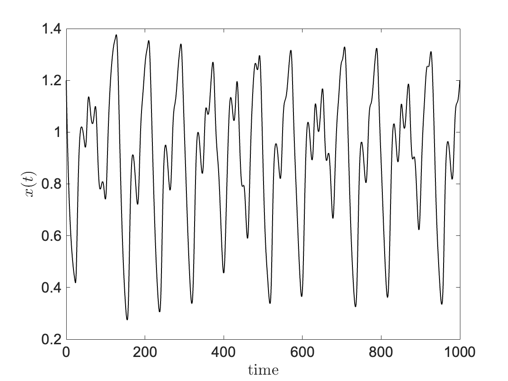

# LSTM forecasting

In this page we illustrate the capabilities of a LSTM neural network in terms of forecasting. Here we assume that the reader is already familiar with theory behind LSTM networks and with neural networks in general. The notation and the problem definition are briefly introduced. Let the sequence $\mathbf{X}\_T=\\{ x_1,x_2,...,x_T \\}$ denote a multivariate time-series sampled at discrete points $x_i \in \mathbb{R}^n$. Let $\mathbf{X}\_B \subset \mathbf{X}\_T$ denote a batch of $b$ samples $\\{ x\_{t-b+1},...,x_t \\}$. We consider the problem of forecasting $x_{t+1}$ given $\mathbf{X}\_B$. In particular, the loss function with respect to a bastch of data is defined by

$$
\mathcal{L}_B(\theta) = \| x_{t+1} - h_\theta(\mathbf{X}\_B) \|_2,
$$

with $h_\theta$ being the LSTM network. The overall loss is thus

$$
\mathcal{L}(\theta) = \frac{1}{|\mathcal{B}|} \sum_{B \in |\mathcal{B}|} \mathcal{L}_B(\theta). 
$$

We consider the problem of forecasting $x_{T+1}$ given $\mathbf{X}_T$. 

The prototype model employed are the Mackey–Glass equations. They refer to a family of delayed differential equations used to model blood cell production. Our interest here lies in the fact that the dynamics of the systems depends non-linearly from past information. This mimics finanacial mechanisms that react with a certain dealy to key events in the past. 

The equations are the following:

$$
\frac{dx(t)}{dt} = \frac{\beta x(t-\tau)}{1+x(t-\tau)^n} - \gamma x(t). \qquad (1)
$$

An example of the solution $x(t)$ over time is shown in Figure 1. Parameters have been chosen such that the system becomes chaotic. 

  

<b>Figure 1:</b> Evolution of $x(t)$ over time.

